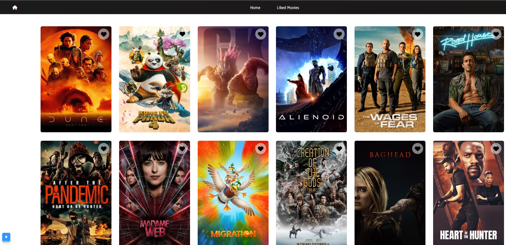

# Movie Listing App

This is a simple Movie Listing app where you can add movies to your favorites and remove them from the favorites list.

The app is built with React, Redux, and deployed on Netlify.

To visit the Movie App [click here](https://subtle-quokka-f40ec7.netlify.app).

## Stack

- Create React App
- React Redux
- React Router
- React Router Redux
- Netlify

##Getting Started with Movie App React Redux

- To clone the repository, navigate to your terminal and run the following commands:
- git clone https://github.com/oosunkeye/movie-cineplex.git
- npm install
- npm start
  

